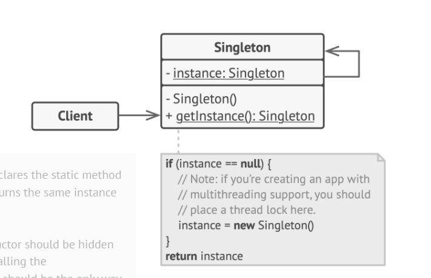

This pattern helps in case you need a only single instance of any class to be created and reused. It allows only to create single object and provides a global acces point to get this shared object




- Normal way of single can be broken using
    1. Serialization - by storing the object in file and then deserializing it gives different object (Solution override canResolve method in the class which return instance)
    2. Reflecctions - we can get the construnctors and make it accessible which again can be used to create new object breaking singleton

### To solve this best way is to use enum which are thread safe and constructors are managed by JVM only

```java
public enum Singleton {
    INSTANCE;
    public void doSomethind() {
        //any method
    }
}
```

- refer : [SIngleton-Reference](https://github.com/shabbirdwd53/design_patterns/blob/main/singleton/src/main/java/EnumSingleton.java)
