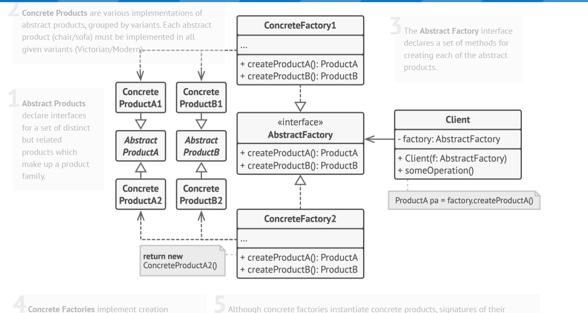

## Abstract Factory

"This pattern is used when you want to create families of related products. For example, rendering GUI components for Windows and MacOS requires different implementations for dialog boxes and buttons.

An abstract interface is defined, which concrete factories (such as Windows and MacOS) implement. This allows new products to be added easily in the future without changing client code.

